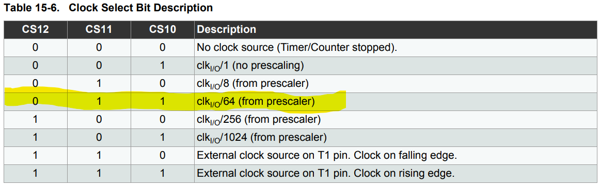

# Lab 3 - Working with Timers
### Objective
- Test the concepts of interrupt routines, timers, GPIO input/output, and volatile variables.

### Exercise

- Create 2 tasks that will run simultaneously and 1 foreground task which will act as the main task. Task specifics are detailed below:

#### Task Table
| # | Frequency (Hz) | Timer | Task | 
|--|-- | -- | -- |
| 1 | 1 | 1 | Blink green LED, increment counter |
| 2 | 10 | 2 | - Read input button state; red LED state is equal to input button state
| Main | 1/3 | n/a | Prints counter to serial

## Hardware Setup

## Task Flow Chart

## Code Flow Chart

### Timer Configuration
The Arduino UNO board comes with 3 timers; two 8-bit timers (Timer0 and Timer2) and one 16-bit timer (Timer1). These timers work as counters incrementing by 1 at the rate of the main clock, which is 16 MHz. Once the count matches the value in the output compare register, the timer interrupt flag is raised for the interrupt routine, and the count is reset when configured in "clear timer on compare match" (CTC) mode.\
\
To configure the timers to function properly for the task needs, only 3 registers for each timer need to be configured; the output compare register ( OCR(Timer#)(A/B) ), the control register ( TCCR(Timer#)(A/B) ), and the interrupt mask register (TIMSK(Timer#)). Without any configurations, Timer0 and Timer2 can operate from 62.5 to 16,000 kHz, and Timer1 can operate from roughly 0.244 to 16,000 kHz. Prescalars can be configured in the control registers to lower the rate at which the internal counters increment, lowering the minimum rate of the timers. Each timer has available prescalars of 8, 64, 256, and 1024 available, with minimum timer rates listed below by prescalar.
| Prescalar | 8-bit min | 16-bit min | 8-bit max | 16-bit max |
| -- | -- | -- | -- | -- |
|1|62.5 kHz|244.1 Hz|16 MHz|16 MHz|
|8|7.8125 kHz | 30.5 Hz | 2 MHz | 2 MHz |
|64| 976.5 Hz| 3.81 Hz | 250 kHz | 250 kHz |
|256| 244.1 Hz | 0.95 Hz | 62.5 kHz | 62.5 kHz |
|1024| 61.0 Hz | 0.24 Hz | 15.625 kHz | 15.625 kHz |

Even with a prescalar of 1024, 8-bit timers are unable to satisfy any task needs, since only having 8 bits severly limits the minimum timer rate to 61 Hz.
\
With that knowledge, only Timer1 can be used to satisfy the task needs, meaning that only one timer is available to be used. To mitigate this issue, another counter variable will be implemented. Timer1 allows the minimum timer rate to be roughly 3.81 Hz with a prescalar of 64. Since only 1 timer rate can be satisfied, 10 Hz will be configured with Timer1 and the additional counter variable will be implemented to effectively simulate 1 Hz. Then, all that's needed is to determine the ouput compare value so that the timer flag is raised at a rate of 10 Hz.
### Updated Task Table
| # | Frequency (Hz) | Timer | Task | 
|--|-- | -- | -- |
| 1 | 1 | variable | - Blink green LED, increment counter |
| 2 | 10 | 1 | - Read input button state; red LED state is equal to input button state
| Main | 1/3 | variable | - Prints counter to serial

### Timer Setup Steps
1. Reset control registers A and B by setting them equal to 0. 
2. Set the output compare A value.
3. Configure the wave-generation mode to CTC. WGM12 is located in timer control register B (TCCR1B). 

4. Configure the clk prescalar to 64. CS11 and CS10 are located in timer control register B (TCCR1B).

5. Configure the interrupt mask register to raise the interrupt flag when count matches the output compare A value.
 
6. Re-enable interrupts. 

## Discussion Questions
1. What are the consequences by not declaring the counter variable as volatile?\
    - When declaring a variable as volatile, this is telling the compiler to not optimize memory allocation by changing its address to something more optimal. If this is not done, then errors have a chance to occur when compiling, potentially re-addressing the variable's memory to a location which is already explicitily being used. Errors are more prone to occur when working with many specific memory addreses, as well as when said variable is being used by different functions.
2. What are the consequences of implementing too much code inside an interrupt routine? What is a possible solution?\
    - When an interrupt occurs, it completely haults everything in the program to take care of the interrupt. If too much code is in the interrupt routine, then the chances of errors occuring related to timing significantly rise. This can be mitigtated by reducing the amount of code in interrupt routines, such as simply raising a boolean flag in the interrupt to be evaluated in the main loop.